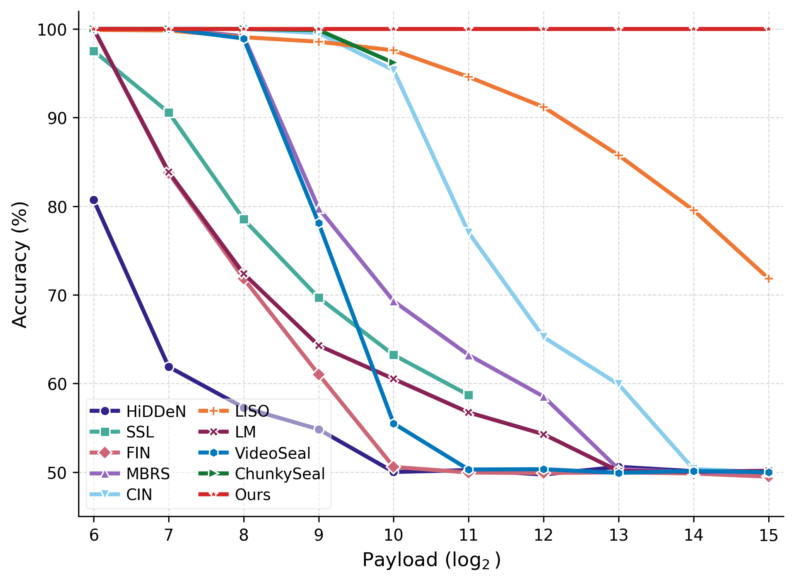
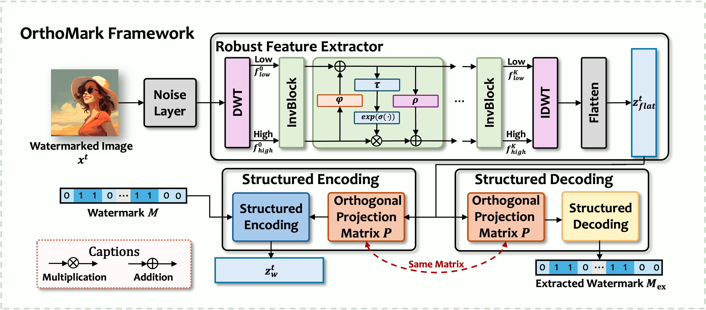
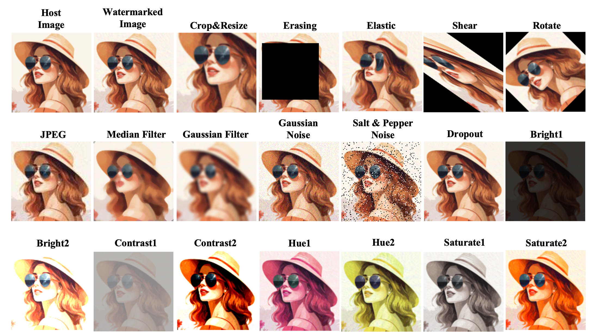

# OrthoMark

<p align="center">
  <b>✨ Revisiting Coding-Based Approaches to Overcome the Curse of Dimensionality in Learning-Based Watermarking ✨</b>
</p>

<p align="center">
  <a href="https://openreview.net/pdf?id=msoH5OGwdt"></a>
  <a href="#"></a>
  <a href="#"></a>
  <a href="#license"></a>
</p>

<p align="center">
  <b>👨‍🔬 Yupeng Qiu, Han Fang, and Ee-Chien Chang</b>
</p>

<p align="center">
  <i>🎉 Accepted at ICML 2026 🎉</i>
</p>


---

## 🎯 Motivation

Deep learning-based watermarking has achieved remarkable robustness against real-world distortions, but suffers from a critical limitation: **the curse of dimensionality**. As shown below, existing methods experience a dramatic collapse in decoding accuracy when the payload (number of embedded bits) increases, even on clean (undistorted) images.

<p align="center">
  
</p>

**Key observation**: While state-of-the-art deep watermarking methods collapse at high payloads, OrthoMark maintains near-perfect decoding accuracy regardless of capacity, effectively overcoming the curse of dimensionality.

---

## 💡 Key Idea

OrthoMark bridges the gap between **coding-based methods** (e.g., QIM) and **deep learning-based methods**:

| Approach | Strengths | Weaknesses |
|----------|-----------|------------|
| **Coding-based** (QIM) | No capacity collapse | Poor robustness to real-world noise |
| **Deep learning-based** | Strong robustness to diverse distortions | Capacity collapse at high payloads |
| **OrthoMark (Ours)** | ✅ Strong robustness + ✅ No capacity collapse | Best of both worlds |

**Our solution**: Decouple **robust feature extraction** (learned by deep networks) from **watermark encoding/decoding** (performed by structured coding methods).

---

## 🏗️ Framework

<p align="center">
  
</p>

OrthoMark consists of two main modules:

### 1. Robust Feature Extractor (RFE)
- Implemented as an **invertible neural network** (INN) with Haar wavelet (DWT/IDWT) blocks
- Learns distortion-invariant feature representations
- Enables bidirectional mapping between image and feature domains

### 2. Structured Encoding and Decoding (SED)
- Uses **orthogonal carriers** to suppress coding cross-talk
- Employs **QIM-style quantization** for flexible encoding strength
- Scales to high-capacity watermarking without accuracy collapse

---

## 🔬 Distortion Suite

OrthoMark is evaluated against **15 diverse distortions** spanning three categories:

<p align="center">
  
</p>

| Category | Distortions | Parameters |
|----------|-------------|------------|
| **Signal** | JPEG, Median Filter, Gaussian Blur, Gaussian Noise, Salt & Pepper, Dropout | QF=50, k=7, σ=2, σ=0.04, ratio=0.1, drop=0.5 |
| **Geometric** | Crop & Resize, Random Erase, Elastic, Shear, Rotation | 50%, 50%, α=3, ±55°, ±45° |
| **Photometric** | Brightness, Contrast, Saturation, Hue | 0.2-2.0, 0.2-2.0, 0.2-2.0, ±0.1 |

---

## 📁 Project Structure

```
OrthoMark/
├── config.py              # All hyperparameters
├── train.py               # Training script
├── test.py                # Testing script
│
├── models/                # Model definitions
│   ├── orthomark.py       # Main OrthoMark model (RFE)
│   ├── noise.py           # Noise layer wrapper
│   └── combined.py        # Combined noise modules
│
├── core/                  # Core watermarking logic
│   ├── carriers.py        # Orthogonal carrier generation
│   ├── embedding.py       # QIM embedding functions
│   ├── decoding.py        # Watermark decoding
│   ├── losses.py          # Loss functions (cosine periodic loss)
│   ├── optimizers.py      # Optimizer utilities
│   └── noise_builder.py   # Noise layer construction
│
├── attacks/               # Distortion/attack modules
│   ├── jpeg.py            # JPEG compression (differentiable & non-diff)
│   ├── geometric.py       # Crop, resize, shear, rotation
│   ├── gaussian_noise.py  # Additive Gaussian noise
│   ├── gaussian_blur.py   # Gaussian blur
│   ├── median_filter.py   # Median filtering
│   ├── salt_pepper.py     # Salt & pepper noise
│   ├── color.py           # Brightness, contrast, hue, saturation
│   ├── dropout.py         # Random dropout
│   ├── erase.py           # Random erasing
│   ├── elastic.py         # Elastic deformation
│   └── identity.py        # Identity (no distortion)
│
├── utils/                 # Utilities
│   ├── helpers.py         # General helper functions
│   ├── metrics.py         # PSNR and other metrics
│   └── datasets.py        # Data loading
│
└── docs/                  # Documentation assets
    ├── framework.png
    ├── acc_vs_capacity.png
    └── distortion.png
```

---

## 🚀 Quick Start

### Installation

```bash
# Clone the repository
git clone https://github.com/QQiuyp/OrthoMark.git
cd OrthoMark

# Install dependencies
pip install torch torchvision kornia numpy pillow natsort
```

### Training

```bash
python train.py
```

### Testing

```bash
python test.py
```

## ⚙️ Configuration

Key hyperparameters in `config.py`:

| Parameter | Default | Description |
|-----------|---------|-------------|
| `message_length` | 64 | Number of bits to embed |
| `qim_Delta` | 2 | QIM quantization step size |
| `joint_steps` | 500 | Training optimization steps |
| `test_joint_steps` | 1000 | Testing optimization steps |
| `adv_mse_w` | 300 | MSE weight for image quality |
| `noise_type` | "NGMIX" | Noise type for training |
| `V_mode` | "ortho" | Carrier mode (ortho/rand_unit) |

---

## 📊 Experimental Setup

### Dataset
- **Training**: COCO dataset
- **Evaluation**: USC-SIPI image dataset
- **Resolution**: 128×128 RGB images

### Evaluation Metrics
- **Visual Quality**: PSNR (Peak Signal-to-Noise Ratio)
- **Robustness**: Bit decoding accuracy under distortions
- **Capacity**: Number of bits reliably embedded

---

## 📈 Results

OrthoMark achieves state-of-the-art performance:

- ✅ **High Capacity**: Near-perfect accuracy at payload dimensions up to 32,768 bits
- ✅ **Strong Robustness**: State-of-the-art robustness against 15 diverse distortions
- ✅ **Visual Quality**: Watermarked images with PSNR > 40 dB

---

## 📝 Citation

```bibtex
@inproceedings{qiu2026orthomark,
  title={Revisiting Coding-Based Approaches to Overcome the Curse of Dimensionality in Learning-Based Watermarking},
  author={Qiu, Yupeng and Fang, Han and Chang, Ee-Chien},
  booktitle={Forty-third International Conference on Machine Learning},
  year={2026}
}

```

---

## 📄 License

This project is released under the MIT License.

---

## 📬 Contact

For questions or issues, please open a GitHub issue or contact:

- 👨‍💻 **Yupeng Qiu** - [qiu_yupeng@u.nus.edu](mailto:qiu_yupeng@u.nus.edu)
